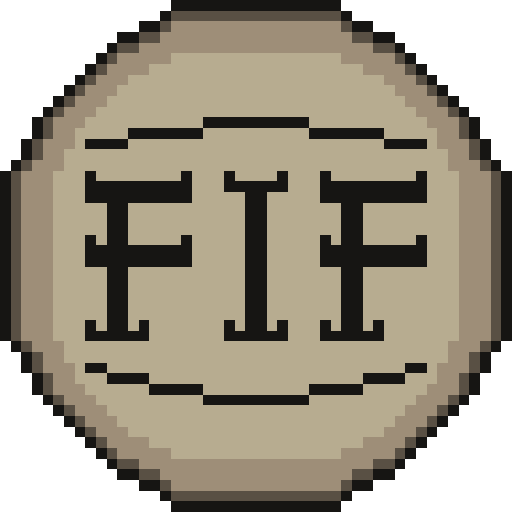

# Fif
<p align=center>
  
</p>
Fif is a 2D game engine with an editor (fifed).

# Table of contents
- [To do](#to-do)  
- [Modules](#modules)  
- [Building](#building)  
- [Contributing](#contributing)  
- [Dependencies](#dependencies)  

# Modules
Fif is split into core module and other independent modules:
- gfx
- input
- imgui
- lua_scripting
- native_scripting

# Building
- ```./scripts/configure.sh``` - configure the build targets
- ```cmake --build build/debug``` - compile a debug build
- ```cmake --build build/release``` - compile a release build
- if you use nvim you can press `F4` to compile a debug build, `Shift+F4` to compile a release build, `F5` to run the debug build, `Shift+F5` to run the release build

# Contributing
Fif is open to contributions, make sure to format your code with clang-format before submitting a pull request though

# Dependencies
The dependencies are used as submodules:  
* If you already cloned the repo, run ```git submodule update --init --recursive```  
* To clone the repo with submodules ```git clone https://github.com/rxn7/fif --recurse-submodules -j8```  

## Libraries
- [glm](https://github.com/g-truc/glm) ([MIT license](https://github.com/g-truc/glm/blob/master/copying.txt))   
- [glfw](https://github.com/glfw/glfw) ([zlib license](https://github.com/glfw/glfw/blob/master/LICENSE.md))     
- [glad](https://github.com/nitrix/glad/) ([UNLICENSE](https://github.com/nitrix/glad/blob/master/UNLICENSE))   
- [ImGui](https://github.com/ocornut/imgui) ([MIT license](https://github.com/ocornut/imgui/blob/master/LICENSE.txt))   
- [entt](https://github.com/skypjack/entt) ([MIT license](https://github.com/skypjack/entt/blob/master/LICENSE))    
- [lua-cmake](https://github.com/lubgr/lua-cmake) ([MIT license](https://github.com/lubgr/lua-cmake/blob/master/LICENSE))    
- [sol2](https://github.com/ThePhD/sol2) ([MIT license](https://github.com/ThePhD/sol2/blob/develop/LICENSE.txt))    
- [stb_image](https://github.com/nothings/stb/blob/master/stb_image.h) ([Public Domain license](https://github.com/nothings/stb/blob/master/stb_image.h))
- [tiny file dialogs](https://sourceforge.net/projects/tinyfiledialogs) ([zlib license](https://sourceforge.net/p/tinyfiledialogs/code/ci/master/tree/README.txt#l1))

## Fonts
- [iosevka](https://github.com/be5invis/Iosevka) ([SIL Open Font License 1.1](https://github.com/be5invis/Iosevka/blob/main/LICENSE.md))
